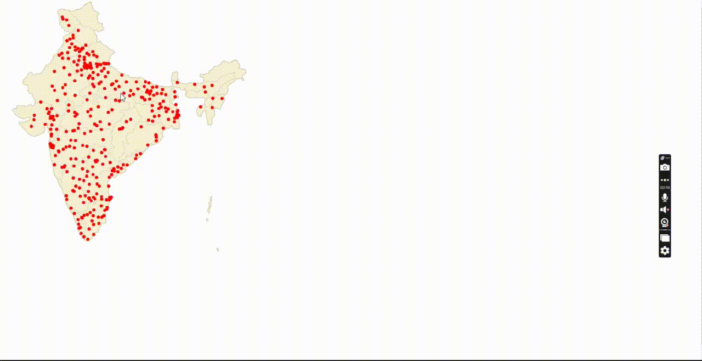

# India Temperature and Humidity Visualization

This project visualizes hourly temperature and relative humidity data for various cities in India. The data is displayed on an interactive map, and clicking on a city dot shows the corresponding temperature and humidity plots.

## Features

- **Interactive Map**: Displays a map of India with clickable dots representing cities.
- **Temperature Plot**: Shows hourly temperature data for the selected city.
- **Humidity Plot**: Shows hourly relative humidity data for the selected city.
- **Responsive Layout**: The map and plots are displayed side by side, with the plots stacked vertically.

## Prerequisites

- Julia (version 1.6 or higher)
- Bonito.jl
- CSV.jl
- DataFrames.jl
- JSON.jl
- PlotlyJS.jl
- HTTP.jl

## Installation

1. **Install Julia**: Download and install Julia from [julialang.org](https://julialang.org/downloads/).

2. **Clone the Repository**:
   ```bash
   git clone https://github.com/Priynsh/indiabonito.git
   cd indiabonito
 # Video Demo

